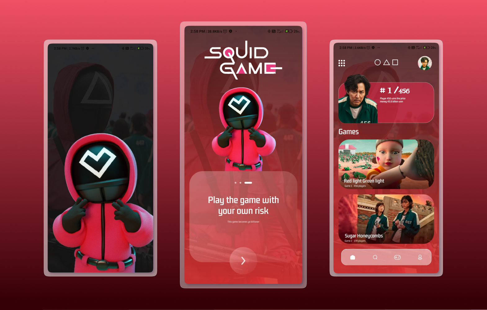

# Squid Game UI in React Native
## Overview :
I tried to create Squid game design which purely made in React Native. Loved the process of creating it.



## Figma File :

https://www.figma.com/file/eRQEDShMwjU4NWK2r9KCs3/Squid-game?node-id=0%3A1

## Installation :
* Clone repository and install dependencies:
``` 
$ git clone https://github.com/kb-codes/netflix-clone.git
$ cd netflix-clone
$ npm i
```

* Run application :
```
$ npm start
```
